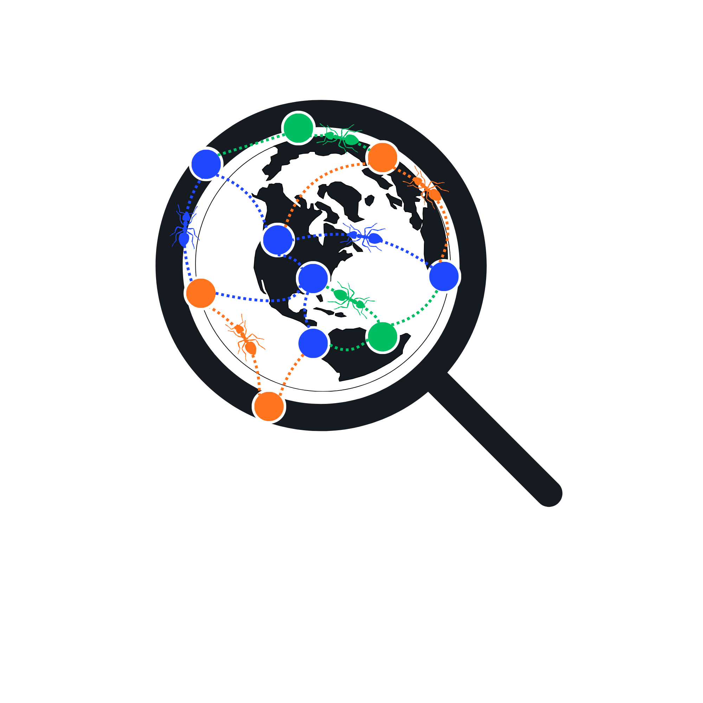

<div align="center">
  

  <h1>ColonySearch</h1>
  <p><strong>A decentralized search engine inspired by ant colony optimization.</strong></p>

  <p>
    
    
    
    
  </p>
</div>

---

## What is ColonySearch?

ColonySearch is a proof-of-concept distributed search engine with no central server and no single index. Instead, a mesh of independent nodes each hold a local SQLite full-text index. When a query enters the network, it propagates through the graph the same way an ant colony discovers food: following **pheromone trails** left by successful past queries.

Nodes that return good results gain reputation. Queries naturally flow toward high-reputation nodes. Dead ends evaporate. The network self-organizes.

> Built as a university project for the *Introduction to Blockchain* module at THN.

---

## How it works

```
User query
    │
    ▼
Entry Node  ──pheromone routing──▶  Node A  ──▶  Node B
    │                                               │
    │◀──────────── ranked results ─────────────────┘

Result score = BM25 × node_reputation^α
```

1. **Local index** — every node indexes its own corpus slice using SQLite FTS5 (BM25 scoring built-in).
2. **Pheromone routing** — the router consults a NetworkX graph and forwards queries along edges weighted by pheromone concentration.
3. **Reputation** — after a query resolves, nodes that contributed good results receive a reputation boost; pheromone on unused paths evaporates over time.
4. **No coordinator** — every routing decision is made locally. There is no master node.

---

## Features

- Fully decentralized — no central index, no coordinator
- ACO-inspired pheromone routing with evaporation
- BM25 × reputation hybrid ranking (tunable `alpha`)
- Rich corpus scraper: Wikipedia, arXiv, OpenAlex, Semantic Scholar, GitHub READMEs, DEV.to, and more
- Interactive web UI (Flask + vanilla JS) with live result cards
- Network visualization via Matplotlib / Plotly
- Benchmark suite comparing swarm routing against a naive broadcast baseline

---

## Quickstart

```bash
# 1. Create and activate a virtual environment
python -m venv venv && source venv/bin/activate

# 2. Install dependencies
pip install -r requirements.txt

# 3. Scrape a corpus (optional — uses existing data if present)
python data/scraper.py                    # academic sources
python data/scraper.py --companies        # corporate/NGO sources
python data/scraper.py --topics climate_change,ai_ethics

# 4. Start the server
python server.py

# 5. Open http://localhost:5000 in your browser
```

---

## Project layout

```
ColonySearch/
├── server.py          # Flask entry point + /search /forward /status endpoints
├── node.py            # Node class: SQLite FTS5 index, local query execution
├── router.py          # ACO routing: pheromone selection + evaporation
├── network.py         # NetworkX graph topology + node registry
├── reputation.py      # Reputation model + pheromone update after query resolves
├── visualise.py       # Network + query-path visualizations
├── benchmark.py       # Swarm vs. broadcast baseline comparison
├── data/
│   ├── scraper.py     # Multi-source corpus scraper
│   └── database_setup.py
└── templates/
    ├── index.html     # Search UI
    └── results.html   # Result cards
```

---

## Corpus scraper

The scraper populates each node's local index from a variety of sources grouped into **topic clusters** (e.g. `climate_change`, `ai_ethics`, `programming`, `ml_algorithms`). It supports several modes:

| Flag | What it does |
|---|---|
| *(default)* | Academic/API sources — Wikipedia, arXiv, OpenAlex, Semantic Scholar, DEV.to, GitHub |
| `--companies` | Corporate/NGO HTML sources — WEF, NASA, MIT News, WHO, Quanta, BBC Sport, … |
| `--scikit` | Programming + ML clusters, non-API sources only |
| `--expand` | Follow links already in the corpus JSON, sample randomly, scrape to given depth |
| `--topics a,b` | Restrict any mode to named clusters |
| `--seeds file` | Plain-text file of seed URLs → single "custom" cluster |

---

## Ranking formula

```
score(doc, node) = bm25(doc, query) × reputation(node) ^ alpha
```

`alpha` controls how much node reputation influences the final ranking relative to pure text relevance. Set it to `0` for plain BM25, or higher to heavily favour proven nodes.

---

## Running the benchmarks

```bash
python benchmark.py
```

Compares swarm routing (pheromone-guided) against a broadcast baseline (ask every node, merge all results) on latency, result quality, and network traffic.

---

## Tech stack

| Layer | Technology |
|---|---|
| Web server | Flask 3 |
| Full-text search | SQLite FTS5 (BM25) |
| Graph / routing | NetworkX |
| Visualization | Matplotlib, Plotly |
| HTTP client | Requests + BeautifulSoup |
| Tests | pytest |

---

## License

MIT — see [LICENSE](LICENSE).
